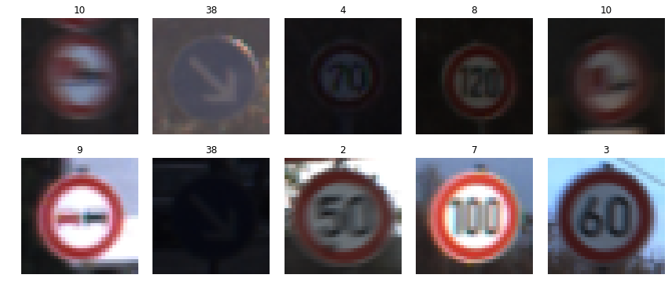
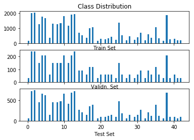
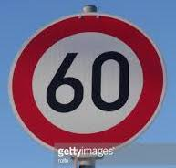
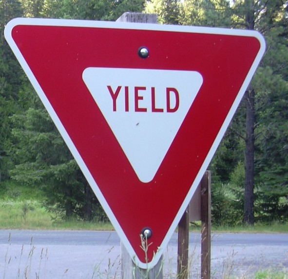
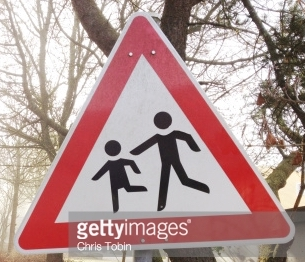
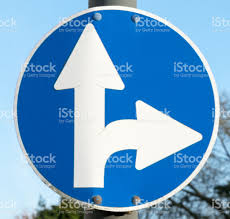

# **Traffic Sign Recognition**

---

**Build a Traffic Sign Recognition Project**

The goals / steps of this project are the following:
* Load the data set (see below for links to the project data set)
* Explore, summarize and visualize the data set
* Design, train and test a model architecture
* Use the model to make predictions on new images
* Analyze the softmax probabilities of the new images
* Summarize the results with a written report

[//]: # (Image References)

[//]:
[//]:
[//]:
[//]:
[//]:
[//]:
[//]:
[//]:

---
### Writeup / README

### Data Set Summary & Exploration

#### 1. Provide a basic summary of the data set. In the code, the analysis should be done using python, numpy and/or pandas methods rather than hardcoding results manually.

I used the numpy/matplotlib to calculate summary statistics of the traffic
signs data set:

* The size of training set is 34799
* The size of the validation set is 4410
* The size of test set is 12630
* The shape of a traffic sign image is (32, 32, 3)
* The number of unique classes/labels in the data set is 43

#### 2. Include an exploratory visualization of the dataset.

Here is an exploratory visualization of some of the images from the train data set.

Here is a histogram of distribution of classes

### Design and Test a Model Architecture

#### 1. Describe how you preprocessed the image data. What techniques were chosen and why did you choose these techniques? Consider including images showing the output of each preprocessing technique. Pre-processing refers to techniques such as converting to grayscale, normalization, etc. (OPTIONAL: As described in the "Stand Out Suggestions" part of the rubric, if you generated additional data for training, describe why you decided to generate additional data, how you generated the data, and provide example images of the additional data. Then describe the characteristics of the augmented training set like number of images in the set, number of images for each class, etc.)

As part of preprocessing, the image was converted to grayscale. Retaining color channels does not contribute significantly for classification. A neural network was trained without grayscaling the image and results was not much different. Also model with grayscale inputs trains faster. After grayscaling the pixels are normalized to values between -1 and 1. Normalizing values makes sure that the neurons are not saturated.

#### 2. Describe what your final model architecture looks like including model type, layers, layer sizes, connectivity, etc.) Consider including a diagram and/or table describing the final model.

My final model consisted of the following layers:

| Layer         		|     Description	        					|
|:---------------------:|:---------------------------------------------:|
| Input         		| 32x32x1 Grayscale image   					|
| Convolution 5x5     	| 1x1 stride, Valid padding, outputs 28x28x8 	|
| RELU					|												|
| Max pooling	      	| 2x2 stride,  outputs 14x14x8 				    |
| Convolution 5x5	    | 1x1 stride, Valid padding, outputs 10x10x16   |
| RELU					|												|
| Max pooling	      	| 2x2 stride,  outputs 5x5x16				    |
| Convolution 3x3	    | 1x1 stride, Valid padding, outputs 3x3x32     |
| RELU					|												|
| Max pooling	      	| 2x2 stride,  outputs 2x2x32				    |
| Fully connected		| RELU 120 neurons                              |
| Fully connected		| RELU 84 neurons                               |
| Softmax				| 43x1                                          |

#### 3. Describe how you trained your model. The discussion can include the type of optimizer, the batch size, number of epochs and any hyperparameters such as learning rate.

The following are the hyper parameters of the best model -
Optimizer: Adam
Learning Rate: 0.001
Batch Size: 128
Epochs: 100

#### 4. Describe the approach taken for finding a solution and getting the validation set accuracy to be at least 0.93. Include in the discussion the results on the training, validation and test sets and where in the code these were calculated. Your approach may have been an iterative process, in which case, outline the steps you took to get to the final solution and why you chose those steps. Perhaps your solution involved an already well known implementation or architecture. In this case, discuss why you think the architecture is suitable for the current problem.

My final model results were:
* training set accuracy of 1.00
* validation set accuracy of 0.9458
* test set accuracy - 0.9197

If a well known architecture was chosen:
* What architecture was chosen?
* Why did you believe it would be relevant to the traffic sign application?
* How does the final model's accuracy on the training, validation and test set provide evidence that the model is working well?

The LeNet architecture was chosen and an additional convolution layer
was added. Comparing the LeNet architecture and this, it was observed
that the model was learning better. The new features learned from the
additional layer provided more context to the classifier. The validation
scores were better compared to the LeNet model.

### Test a Model on New Images

#### 1. Choose five German traffic signs found on the web and provide them in the report. For each image, discuss what quality or qualities might be difficult to classify.

Here are five German traffic signs that I found on the web:

The first, second and fourth images should be relatively easy to classify.
The third and fifth images have watermarks on them which might throw off a
few neurons. Also in the third image there are branches of trees in the image
which may confuse the classifier for stick images in the traffic sign.

#### 2. Discuss the model's predictions on these new traffic signs and compare the results to predicting on the test set. At a minimum, discuss what the predictions were, the accuracy on these new predictions, and compare the accuracy to the accuracy on the test set (OPTIONAL: Discuss the results in more detail as described in the "Stand Out Suggestions" part of the rubric).

Here are the results of the prediction:

| Image			        |     Prediction	        					|
|:---------------------:|:---------------------------------------------:|
| Speed limit (60km/h)  | Speed limit (50km/h)  						|
| Yield     			| Yield 										|
| Children crossing		| Children crossing								|
| Slippery road	      	| Slippery Road					 				|
| Go straight or right	| Go straight or right      					|

The model was able to correctly guess 4 of the 5 traffic signs, which gives an accuracy of 80%.
This compares favorably to the accuracy on the test set of 91.97%

Here are the softmax prediction probabilities for the new test images

| Image			        |     Score	        		        			|
|:---------------------:|:---------------------------------------------:|
| Speed limit (60km/h)  | 1.00  						                |
| Yield     			| 1.00 						    				|
| Children crossing		| 0.99						                	|
| Slippery road	      	| 1.00					        				|
| Go straight or right	| 0.99      			                		|

As predicted, Images 1,2 and 4 do really well since there is no interference.
However, the classification is incorrect for Image 1. The `60` in the image
is recognized as `50`. Scores for Images 3 and 5 are less then perfect, but
the classification is right.

#### 3. Describe how certain the model is when predicting on each of the five new images by looking at the softmax probabilities for each prediction. Provide the top 5 softmax probabilities for each image along with the sign type of each probability. (OPTIONAL: as described in the "Stand Out Suggestions" part of the rubric, visualizations can also be provided such as bar charts)

For the first image, the model is positively sure that this is a Speed Limit (50km/h)
(probability of 1.0). The image is of Speed Limit (60km/h).
However, the model does pick the correct class in top 5.
The top five soft max probabilities are

| Probability         	|     Prediction	        					|
|:---------------------:|:---------------------------------------------:|
| 1.00000000e+00        | Speed limit (50km/h)   									|
| 6.11807849e-09 		| Speed limit (60km/h) 										|
| 6.55201913e-13		| Speed limit (80km/h)											|
| 8.23120572e-16	    | Wild animals crossing					 				|
| 5.40999668e-21		| Stop      							|

For the second image, the model correctly predicts the Yield sign image.
The top five soft max probabilities are

| Probability         	|     Prediction	        					|
|:---------------------:|:---------------------------------------------:|
| 1.00000000e+00        | Yield   									|
| 0.00000000e+00        | Speed limit (20km/h) 										|
| 0.00000000e+00	    | Speed limit (30km/h)											|
| 0.00000000e+00	    | Speed limit (50km/h)					 				|
| 0.00000000e+00	    | Speed limit (60km/h)      							|

For the third image, the model correctly predict the Children crossing sign.
The top five soft max probabilities are

| Probability         	|     Prediction	        					|
|:---------------------:|:---------------------------------------------:|
| 9.99990225e-01        | Children crossing   							|
| 9.09688424e-06     	| Right-of-way at the next intersection			|
| 6.26757867e-07		| Pedestrians									|
| 6.04365655e-11	    | General caution					 			|
| 1.59309783e-12		| Roundabout mandatory      					|

For the fourth image, the model correctly predicts the Slippery road sign.
The top five soft max probabilities are

| Probability         	|     Prediction	        					|
|:---------------------:|:---------------------------------------------:|
| 1.00000000e+00        | Slippery road   								|
| 3.68671671e-09     	| Dangerous curve to the right 					|
| 3.53683095e-19		| Right-of-way at the next intersection			|
| 7.26398773e-23	    | Bicycles crossing					 			|
| 4.62209776e-24	    | Children crossing      						|

For the fifth image, the model correctly predicts the
Turn right of go straight sign.
The top five soft max probabilities are

| Probability         	|     Prediction	        					|
|:---------------------:|:---------------------------------------------:|
| 9.99999881e-01        | Go straight or right   						|
| 9.64615268e-08     	| Priority road 								|
| 2.60093531e-12		| Road work									    |
| 2.91844184e-20	    | End of no passing					 			|
| 5.06976746e-22		| Children crossing      						|

### (Optional) Visualizing the Neural Network (See Step 4 of the Ipython notebook for more details)
#### 1. Discuss the visual output of your trained network's feature maps. What characteristics did the neural network use to make classifications?
